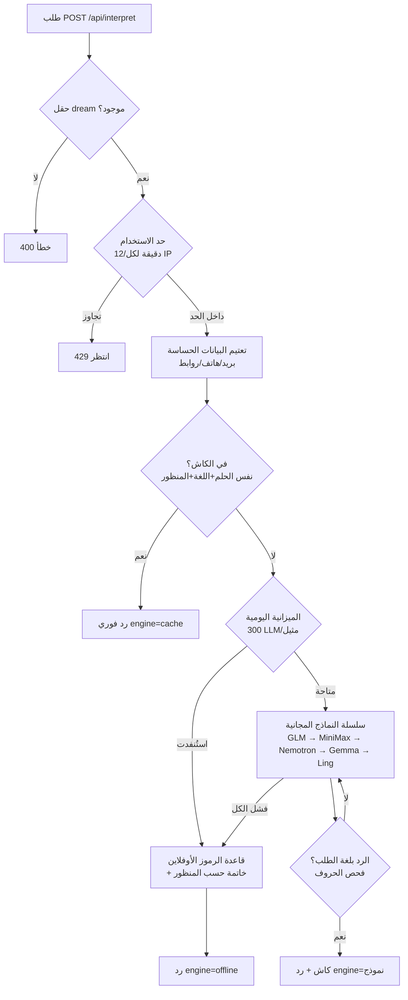
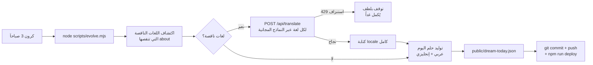
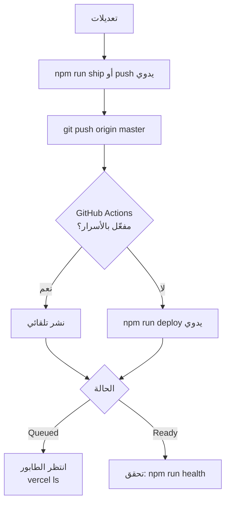
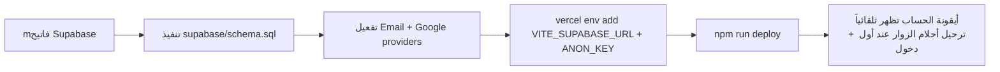

# 🌙 Dreamscope — دليل التشغيل (Workflow)

> **المرجع الرسمي لأي أتمتة أو جلسة عمل على هذا المشروع.** اتبع هذا الملف حرفياً.

- **الموقع:** https://dream-interpreter-alpha-ruddy.vercel.app
- **الريبو:** https://github.com/Ansygroup/dream-interpreter
- **المنصة:** Vercel (project: `dream-interpreter`, team: `ansygroups-projects`)
- **الستاك:** React 18 + Vite + TS + Tailwind (واجهة) • Vercel Functions (API) • i18n خاص بـ 60 لغة

---

## 0) الأوامر الموحدة (كل شيء بأمر واحد)

```bash
npm run build      # بناء كامل (+ توليد صفحات SEO وsitemap)
npm run deploy     # نشر على الإنتاج
npm run evolve     # دورة التطور اليومية (ترجمات + حلم اليوم)
npm run translate  # إكمال ترجمات الواجهة الناقصة فقط
npm run symbols:regen  # إعادة توليد قائمة الرموز من seo-data
npm run health     # فحص صحة الموقع الحي (6 فحوصات)
npm run ship msg="نص الكوميت"  # commit + push + deploy
```

## 0.1) المخططات المرئية

### تدفق التفسير (قبل البرومبت وبعده)


### دورة التطور اليومية (3 فجراً)


### تدفق النشر


### تفعيل الحسابات (عند وصول المفاتيح)


---

## 1) دورة النشر (Deployment)

⚠️ **تكامل Git→Vercel غير مفعّل في هذا المشروع** — الـ push وحده لا ينشر!

```bash
# بعد كل تغييرات:
git add -A && git commit -m "..." && git push origin master
npx vercel deploy --prod --yes     # إلزامي بعد كل push
```

- مدة النشر ~20 ثانية، لكن قد يدخل **طابور انتظار** (حتى ساعات في أوقات الازدحام) — تحقق بـ `npx vercel ls dream-interpreter`
- **بديل تلقائي (يفضَّل تفعيله):** GitHub Actions جاهز في `.github/workflows/deploy.yml` — يتطلب إضافة 3 أسرار في إعدادات الريبو: `VERCEL_TOKEN` (من vercel.com/account/tokens) و`VERCEL_ORG_ID` و`VERCEL_PROJECT_ID` (من `.vercel/project.json`). بعد إضافة الأسرار سينشر تلقائياً مع كل push ويمكن تجاهل النشر اليدوي.

## 2) دورة التطور الذاتي اليومية (Evolve)

**وقت التشغيل:** يومياً 03:00 صباحاً (أتمتة ZCode: "تطور Dreamscope اليومي")

```bash
cd "C:\Users\ansy0\ZCodeProject\projects\repos\dream-interpreter"
node scripts/evolve.mjs
# ثم إن تغيّر ملفات:
git add -A && git commit -m "evolve: daily translations + dream of the day" && git push origin master
npx vercel deploy --prod --yes
```

ماذا يفعل:
1. **يكمل ترجمات الواجهة الناقصة** (44 لغة ذاتية الأساس حالياً) عبر `POST /api/translate` — المفتاح لا يترك Vercel، وسلسلة نماذج مجانية داخلية (GLM → MiniMax → Nemotron → Gemma → Ling)
2. **يولّد "حلم اليوم"** (عربي + إنجليزي) عبر `POST /api/interpret` → `public/dream-today.json` — تظهر تلقائياً في الصفحة الرئيسية

قواعد:
- السكربت يتخطى "حلم اليوم" إذا كان مولّداً لنفس اليوم — لا تشغّله مرتين يدوياً
- إذا فشلت الترجمة بـ HTTP 429 (استنزاف الحصة المجانية 50/يوم) — **توقف بهدوء**، ستُكمل غداً تلقائياً
- أي ملف لغة ينقصه قسم `about` يُعتبر "ناقصاً" ويُعاد ترجمته كاملاً

## 3) محرك التفسير (API)

- `POST /api/interpret` — `{ dream, language, perspective }` → تفسير + رموز + محرك
- **سلسلة هجينة:** 5 نماذج مجانية (بالترتيب) → قاعدة رموز أوفلاين (لا تفشل أبداً)
- **المنظورات الثمانية:** general, islamic, christian, jewish, hindu, buddhist, psychology, chinese — كل منها system prompt مخصص في `api/interpret.js`
- `POST /api/feedback` — 👍/👎 (يُخزَّن سحابياً عند تفعيل Supabase)
- `POST /api/translate` — ترجمة الواجهة (للاستخدام الآلي فقط)
- متغيرات البيئة: `OPENROUTER_API_KEY` (موجود في Vercel Production). اختياري: `DREAMSCOPE_AI_MODEL` لإجبار نموذج مدفوع

## 4) الحسابات والسحابة (Phase 4 — الكود جاهز، ينتظر المفاتيح فقط)

**الكود منشور بالكامل** — وضع الزائر يعمل بدون Supabase، والميزات السحابية تتفعّل تلقائياً عند إضافة المفاتيح:

1. أنشئ مشروعاً في supabase.com (مجاني)
2. افتح SQL Editor والصق محتوى `supabase/schema.sql` ونفّذه (جداول + RLS + trigger تلقائي للبروفايل)
3. فعّل مزودي الدخول: Authentication → Providers → Email (Magic Link) + Google (يحتاج OAuth client من Google Cloud)
4. أضف المتغيرات في Vercel (الواجهة تقرأها):
   ```
   npx vercel env add VITE_SUPABASE_URL production
   npx vercel env add VITE_SUPABASE_ANON_KEY production
   ```
   (القيم من: Supabase → Settings → API)
5. انشر: `npx vercel deploy --prod --yes`
6. أيقونة الحساب تظهر في الشريط العلوي — أول تسجيل دخول يرحّل أحلام الجهاز محلياً للسحابة تلقائياً

ما يعمل بعد التفعيل: رابط سحري بالبريد • جوجل OAuth • مفكرّة سحابية متزامنة • ترحيل تلقائي من الجهاز • تقييمات محفوظة بقاعدة البيانات (الزوار أيضاً)

## 5) مشاكل شائعة وحلولها

| المشكلة | الحل |
|---|---|
| التغييرات لا تظهر على الموقع | النشر اليدوي لم يُنفذ (`npx vercel deploy --prod --yes`) أو النشر في الطابور (`vercel ls`) |
| التفسير يظهر بجودة قوالب | المحرك في وضع offline — الحصة المجانية استُنزفت (429) أو انتهى الرصيد (402). تُجَدَّد الحصة يومياً، أو اشحن رصيداً |
| ترجمة ناقصة في لغة ما | طبيعي في اللغات ذاتية الأساس — الـ cron اليومي يكملها تدريجياً |
| نص عربي/عبري حروفه منفصلة | لا تضف letter-spacing لأي عنصر RTL — القاعدة في `index.css` تحت `[dir="rtl"]` |
| خطأ JSON في ملف ترجمة | `python -c "import json,glob,io; [json.load(io.open(f,encoding='utf-8')) for f in glob.glob('src/i18n/locales/*.json')]"` يعطي الملف المعطوب |

## 6) فهرسة محركات البحث (IndexNow) — مفعّل ✅

- المفتاح: في ملف `.indexnow-key.local` (غير مرفوع للـ git) ومعروض في `/indexnow-key.txt` من Vercel env `INDEXNOW_KEY`
- **كل صفحات الموقع (22,485) قُدّمت** إلى Bing/Yandex/Seznam — التحقق: أي صفحة جديدة تُرسل بنفس النمط (POST إلى api.indexnow.org، حد 9000/طلب)
- الأتمتة الليلية ترسل الروابط الجديدة بعد كل نشر فيه توسيع

## 7) قواعد ثابتة (لا تُخترق)

- **⚡ Workflow قبل البرومبت (قاعدة المالك):** أي ميزة جديدة أو تغيير كبير يبدأ بـ workflow مكتوب (الخطوات، الملفات المتأثرة، التراجع) يُعرض على المالك ويُنتظر موافقته قبل كتابة أي كود
- **الأداء:** ملفات اللغات تُحمَّل كسولاً — لا تستورد locale في أعلى ملف
- **RTL:** استخدم CSS logical properties؛ عربية/عبرية/فارسية/أردية = rtl تلقائياً من `languages.ts`
- **SEO:** صفحات `/seo/*` تُقدَّم من `api/seo.js` (سيرفر) — تعديلات الواجهة SPA لا تمسّها؛ 26,573 صفحة
- **الإيرادات:** AdSense (`ca-pub-4665838048081250`) والروابط المتبادلة (AI Blog, Ansy Group) — لا تُزال
- **الخصوصية:** نص الأحلام يُعتَّم بياناته الحساسة (بريد/هاتف/روابط) قبل أي نموذج، ولا يُخزَّن في أي مكان بدون حساب صريح
- **حماية الحصة:** ميزانية LLM اليومية + كاش الردود المتطابقة + حد 12/دقيقة لكل IP — لا تُرفع بدون قرار
